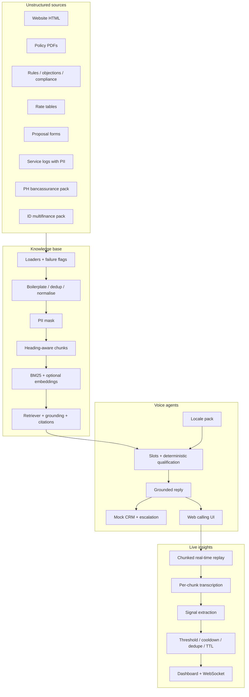

# Sunfyre -- Grounded Voice Operations

Grounded voice operations for insurance and consumer finance.

Sunfyre is a single FastAPI application that turns mixed, messy business content into a searchable knowledge base, then uses that knowledge to run live voice agents. Answers are retrieved and cited. Out-of-scope questions are refused. A live-insights pipeline watches the call **while it is happening** and nudges an agent with confidence, cooldown, and duplicate suppression.

Three markets share one engine:

| Market | Brand (fictional) | Use case |
|---|---|---|
| India | Sentinel Health | Health-insurance lead qualification |
| Philippines | ShieldLife × Banco Isla | Bancassurance / term-life qualification (Taglish) |
| Indonesia | MitraDana | Multifinance installment support (Bahasa + regional phrasing) |

Sentinel Health, ShieldLife, and MitraDana are **fictional** products. The corpus is purpose-built (website HTML, PDFs, rate tables, outdated brochure, PII-laden logs, a document that fails to parse) so the pipeline can show cleaning, versioning, and failure handling without copying a live insurer’s files.

---

## What this repository contains

| Capability | UI | Package | Evidence |
|---|---|---|---|
| Voice qualifier | [/agent](http://127.0.0.1:8000/agent) | `q1_voice_agent/` | [`docs/q1_test_calls.md`](docs/q1_test_calls.md) |
| Knowledge base | [/kb](http://127.0.0.1:8000/kb) | `q2_knowledge_base/` | [`docs/q2_knowledge_base.md`](docs/q2_knowledge_base.md), [`docs/q2_retrieval_tests.md`](docs/q2_retrieval_tests.md), [`data/kb/build_report.md`](data/kb/build_report.md) |
| Native-language bots | [/native](http://127.0.0.1:8000/native) | `q3_native_bots/` | [`docs/q3_localization.md`](docs/q3_localization.md), [`docs/q3_test_calls.md`](docs/q3_test_calls.md), [`docs/q3_asr_report.md`](docs/q3_asr_report.md) |
| Live insights | [/live](http://127.0.0.1:8000/live) | `q4_live_nudges/` | [`docs/q4_latency.md`](docs/q4_latency.md) |

Also in this repo:

- Architecture: [`docs/architecture.md`](docs/architecture.md)
- Limitations and production plan: [`docs/limitations.md`](docs/limitations.md)
- Walkthrough script: [`docs/video_walkthrough.md`](docs/video_walkthrough.md)
- Environment template: [`.env.example`](.env.example) — **never commit `.env`**
- Recorded calls and walkthrough video: [`data/recordings/`](data/recordings/) (paths listed below)

OpenAPI is served at [`/docs`](http://127.0.0.1:8000/docs) when the app is running.

---

## How it works



**Design rules**

- The knowledge base is the source of truth. FAQs, waiting periods, objections, and premiums are **not** hardcoded in the system prompt.
- Grounding is strict. Low confidence → the agent says it does not have that information.
- Qualification is a Python engine from the underwriting grid. The model cannot declare someone “approved”.
- Philippines and Indonesia are **localized** (sector, terms, politeness, fallback language) — not a translation of the India script.
- Live nudges are generated from **chunked real-time replay**, not from analysing a finished file after upload.
- Nudge spam is controlled: confidence threshold, cooldown, duplicate evidence, TTL, and priority.

One customer turn:

1. Speech-to-text (or typed text) using the locale’s language hint and vocabulary prompt.
2. Slot fill (name, age, city, cover, conditions, …).
3. Hybrid retrieve, filtered by market (`IN` / `PH` / `ID`).
4. Grounding tier: high → answer from chunks; medium → verify; low → refuse.
5. Deterministic `qualify(slots)`.
6. Optional action: CRM lead, callback, human escalation webhook.
7. TTS in a native voice (`en-US`, `fil-PH`, or `id-ID`).

---

## Prerequisites

- **Python 3.10+**
- Windows, macOS, or Linux
- A modern browser (Chrome recommended for microphone)
- Optional: an OpenAI API key for Whisper, GPT replies, and dense embeddings

Without a key the stack still runs end-to-end: BM25 retrieval, template agent replies, Edge TTS, and rule-based live nudges.

---

## Setup

From the repository root:

```powershell
python -m venv .venv
.\.venv\Scripts\activate
pip install -r requirements.txt
copy .env.example .env
```

macOS / Linux:

```bash
python3 -m venv .venv
source .venv/bin/activate
pip install -r requirements.txt
cp .env.example .env
```

Edit `.env` if you have a key:

```
OPENAI_API_KEY=sk-...
```

Leave it empty (or omit the line) to run offline. Do not commit `.env`, API keys, or real customer data.

The knowledge base under `data/kb/` is already built in this checkout. Rebuild only if you change sources (see below).

---

## Run the console

```powershell
python -m app
```

Open **http://127.0.0.1:8000**

| Path | What you do there |
|---|---|
| `/` | Home — four consoles |
| `/agent` | Sentinel Health voice qualifier (English) |
| `/kb` | Search the knowledge base with citations and confidence |
| `/native` | ShieldLife (PH) or MitraDana (ID) |
| `/live` | Replay calls in chunks and inspect nudges, suppressions, latency |
| `/docs` | Interactive API |
| `/agent/leads` | Mock CRM leads created from qualification |

Hard-refresh (**Ctrl+F5**) if an old cached page appears.

### Voice qualifier (`/agent`)

1. Click **Start call**. The agent speaks the opening disclosure (TTS).
2. **Type** in the box and press Send. This is the reliable path on restricted networks.
3. **Talk** uses Whisper when `OPENAI_API_KEY` is set. Without a key, Chrome speech may fail on campus Wi‑Fi — typing is the same agent.
4. Watch slots, qualification, citations, and live-coach nudges in the sidebar.

Try:

```
Hi, my name is Rohan Mehta.
I am 34 years old, I live in Pune.
I want to cover myself, my wife and one child.
What is the stock price of Sentinel Health?
I want to speak to a human advisor please, not a bot.
```

### Knowledge base (`/kb`)

Search a product, policy, qualification, FAQ, or objection question. Pick India / Philippines / Indonesia. Each hit shows record id, category, score, citation, and why it ranked. Out-of-scope queries should come back **low** confidence.

Try: `waiting period for pre-existing`, `too expensive`, `stock price of Sentinel`.

### Native-language bots (`/native`)

Select Philippines or Indonesia, start a call, then type Taglish or Bahasa.

Philippines:

```
Hello po, ako si Ana Reyes, 32, from Quezon City.
Magkano po ang premium for one million coverage?
Gusto ko kausapin ang tao sa branch, please.
```

Indonesia:

```
Cicilannya telat, dendanya kejebak mahal banget dong.
Nggih Mbak, kula Pak Slamet, umur 47, Yogyakarta.
Kula nyuwun ngomong kalih petugas cabang, nggih.
```

TTS uses Edge neural voices (`fil-PH-BlessicaNeural`, `id-ID-GadisNeural`). Fallback replies stay in the customer’s language.

### Live insights (`/live`)

Click a scenario (for example **skipped disclosure**, **missed cross sell**, **noisy ambiguous**). The pipeline ingests the call in timed chunks, then shows transcript, emitted nudges, suppressed alerts, and P50/P95 latency. Replay buttons reuse recorded India / PH / ID transcripts.

This is **not** post-call batch analysis of an uploaded file.

---

## Configuration

Copy [`.env.example`](.env.example). Important variables:

| Variable | Default | Purpose |
|---|---|---|
| `OPENAI_API_KEY` | empty | Enables Whisper, GPT, embeddings |
| `LLM_MODEL` | `gpt-4o-mini` | Chat model for agents and optional live signals |
| `ASR_MODEL` | `whisper-1` | Speech-to-text |
| `EMBEDDING_MODEL` | `text-embedding-3-small` | Dense index; BM25-only if no key |
| `TTS_PROVIDER` | `edge` | `edge` (native PH/ID voices) or `openai` |
| `HOST` / `PORT` | `127.0.0.1` / `8000` | Server bind |
| `CRM_FILE` | `data/crm/leads.jsonl` | Mock CRM |
| `ESCALATION_WEBHOOK_URL` | empty | Optional POST on human escalation |
| `Q4_CHUNK_SECONDS` | `3` | Live-replay chunk size |
| `Q4_CONFIDENCE_THRESHOLD` | `0.65` | Nudges below this are suppressed |
| `Q4_COOLDOWN_SECONDS` | `45` | Same-topic cooldown |
| `Q4_NUDGE_TTL_SECONDS` | `60` | Nudge expiry |
| `Q4_USE_LLM_SIGNALS` | `true` | `false` = rules only |

---

## Rebuild and tests

Rebuild the knowledge base after editing sources:

```powershell
python -m q2_knowledge_base.pipeline --no-embed
```

Drop `--no-embed` when a key is present so retrieval becomes hybrid BM25 + embeddings.

Run the test harnesses (no microphone required):

```powershell
python -m q2_knowledge_base.retrieval_tests
python -m q1_voice_agent.test_calls
python -m q3_native_bots.test_calls
python -m q4_live_nudges.simulate --fast
```

`--fast` skips wall-clock sleeps between chunks. Omit it to replay at real-time speed.

Outputs:

- Retrieval verdicts → `docs/q2_retrieval_tests.md`
- Voice transcripts → `data/transcripts/q1_*.json`, `ph_*.json`, `id_*.json` and markdown in `docs/`
- Live-session JSON → `data/recordings/live_sessions/`
- Latency report → `docs/q4_latency.md`

---

## Recordings and transcripts

### Walkthrough video

| File | Description |
|---|---|
| [`data/recordings/walkthrough.mp4`](data/recordings/walkthrough.mp4) | End-to-end demo: overview, architecture, knowledge-base search, voice flow, multilingual bots, live nudges, fallbacks, and limitations |

Talking points used for that recording: [`docs/video_walkthrough.md`](docs/video_walkthrough.md).

### Recorded voice calls

| File | Market | What it shows |
|---|---|---|
| [`data/recordings/calls/q1_cooperative.mp4`](data/recordings/calls/q1_cooperative.mp4) | India | Cooperative Sentinel Health qualification |
| [`data/recordings/calls/q1_objection.mp4`](data/recordings/calls/q1_objection.mp4) | India | Price / employer-cover objection |
| [`data/recordings/calls/q1_outofscope.mp4`](data/recordings/calls/q1_outofscope.mp4) | India | Out-of-scope questions — no invented answers |
| [`data/recordings/calls/ph_cooperative.mp4`](data/recordings/calls/ph_cooperative.mp4) | Philippines | Taglish bancassurance lead |
| [`data/recordings/calls/id_colloquial.mp4`](data/recordings/calls/id_colloquial.mp4) | Indonesia | Colloquial Bahasa, *denda* / *DP* / *cicilan* |

### Text transcripts (machine-generated test calls)

| File | Scenario |
|---|---|
| `data/transcripts/q1_cooperative.json` | Cooperative lead + CRM |
| `data/transcripts/q1_objection.json` | Objection handling |
| `data/transcripts/q1_conflicting.json` | Conflicting age vs date of birth |
| `data/transcripts/q1_oos.json` | Out of scope |
| `data/transcripts/q1_human.json` | Human escalation |
| `data/transcripts/ph_cooperative_taglish.json` | PH cooperative Taglish |
| `data/transcripts/ph_objection_lapse.json` | PH lapse objection + human |
| `data/transcripts/ph_codeswitch_creditlife.json` | PH code-switch + out of scope |
| `data/transcripts/id_cooperative_formal.json` | ID formal Bahasa |
| `data/transcripts/id_colloquial_denda.json` | ID colloquial + *denda* |
| `data/transcripts/id_jawa_accent_escalation.json` | Yogyakarta phrasing + branch escalation |

Readable tables: [`docs/q1_test_calls.md`](docs/q1_test_calls.md), [`docs/q3_test_calls.md`](docs/q3_test_calls.md).

---

## Repository layout

```
app.py                      # FastAPI entry — one process, all consoles
.env.example                # Environment template (copy to .env)
q1_voice_agent/             # Grounded qualifier, CRM, web calling UI
q2_knowledge_base/          # Ingest, schema, retriever, search UI
q3_native_bots/             # PH / ID locale packs, native TTS UI
q4_live_nudges/             # Chunked pipeline, dashboard, scenarios
shared/                     # Config, LLM, ASR, TTS, PII, embeddings, latency
data/kb/                    # Built records, manifest, build report
data/transcripts/           # Scripted call transcripts
data/recordings/            # Videos + live-session JSON
data/crm/                   # Mock leads (JSONL)
docs/                       # Architecture, tests, latency, limitations
static/                     # Shared console CSS and home page
```

---

## Failure handling already in the product

- Unreadable source PDF → flagged `failed` in the build report; pipeline continues.
- Out-of-scope question → low grounding → spoken refusal.
- Conflicting age vs date of birth → qualification `Referred`, no eligibility promise.
- Customer asks for a human → escalate, optional webhook, stop the pitch.
- Do-not-call phrasing → mark and end.
- No API key → BM25 + template replies + Edge TTS still work.
- Noisy / ambiguous live audio → suppress low-value nudges (see the **noisy ambiguous** scenario).

Known gaps and how this would scale (streaming ASR, diarization, 10× call volume, native-linguist review): [`docs/limitations.md`](docs/limitations.md).
