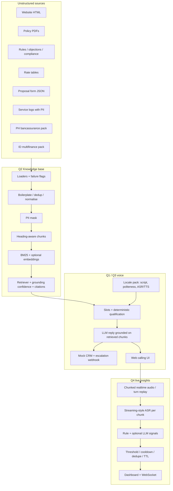

# Architecture

## Why one repo

Q1 must call Q2 at runtime. Q3 is the same agent with a different locale + KB slice (`market=PH|ID`). Q4 reuses Q1/Q3 call transcripts. A split into four folders that cannot import each other would fail the “disconnected knowledge base and voice bot” rejection condition.

## Question 1 use case

**Health-insurance lead qualification** — one of the five options in the PDF.

**Sentinel Health** is a *fictional* insurer invented for the corpus (plans, messy website, outdated brochure, underwriting grid, objection playbook, compliance disclosures, PII-laden service log). It is not a DarwixAI product. The voice bot qualifies leads for Sentinel plans by retrieving those records.

Voice platform: **web calling interface** (browser mic → Whisper → grounded agent → Edge/OpenAI TTS). A PSTN number is optional and not required by the PDF.

## Data flow on one customer turn

1. ASR (language hint + vocabulary prompt from the locale).
2. Slot regex (+ LLM JSON when a key is present).
3. Hybrid retrieve, filtered by `market`.
4. Grounding tier: high → answer from chunks; medium → LLM must verify; low → “I do not have that information”.
5. Deterministic `qualify(slots)` — the model cannot declare someone “approved”.
6. Optional action: CRM lead, callback, escalation webhook.
7. TTS in the locale’s native voice.

## Q4 latency path

`audio chunk received → ASR → signal extraction → nudge controller → dashboard`. Each stage is timed; `docs/q4_latency.md` reports P50/P95 after the simulator.
